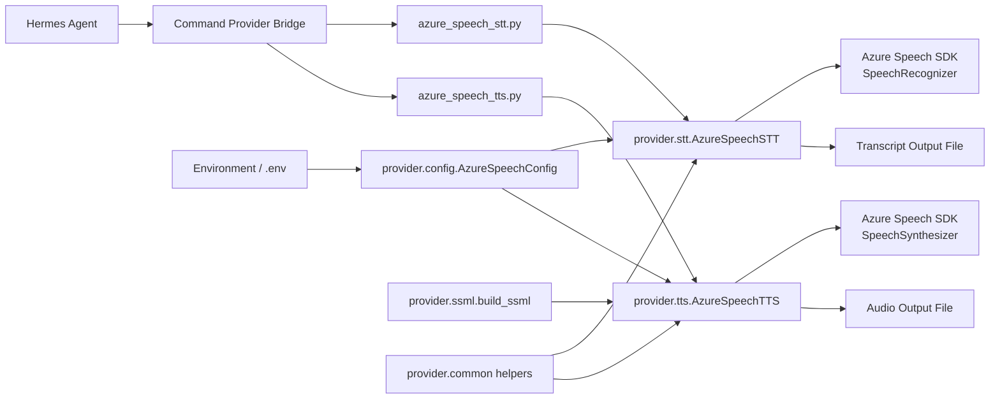

# Architektur: Hermes-Agent und Azure Speech Provider

## Überblick

Dieses Projekt erweitert den Hermes-Agenten um einen Azure Speech-basierenden STT/TTS-Provider. Der Hermes-Agent orchestriert die Sprachbefehle, während der Provider die eigentliche Azure Speech-Integration kapselt.

## Hauptkomponenten

1. Hermes-Agent
   - startet und verwaltet die Sprach- und Befehlsflüsse
   - ruft den Speech Provider für Transkription oder Synthese auf
   - verarbeitet die Ergebnisse weiter in die Hermes-Workflow-Logik

2. Azure Speech Provider
   - stellt die Python-API für STT/TTS bereit
   - kapselt Konfiguration, SSML, Audio-Input/Output und Azure Speech-Ausnahmen
   - ist als eigenständiges Paket organisiert und kann von Einstiegsskripten oder Testumgebungen verwendet werden

3. Launcher-Skripte
   - `scripts/azure_speech_tts.py`
   - `scripts/azure_speech_stt.py`
   - dienen als CLI-Bridge zwischen Hermes und dem Provider-Paket

4. Konfigurations- und Umgebungswerte
   - `AZURE_SPEECH_KEY`
   - `AZURE_SPEECH_REGION`
   - `AZURE_SPEECH_VOICE`
   - `AZURE_SPEECH_LANGUAGE`

## Architekturfluss

Der typische Ablauf ist:

1. Hermes-Agent aktiviert den Sprach-Provider.
2. Das CLI-Skript wird mit Eingabedatei und Ausgabepfad gestartet.
3. Der Provider liest die Azure-Konfiguration.
4. Der Azure Speech SDK wird für STT oder TTS verwendet.
5. Das Ergebnis wird als Datei oder Text zurückgegeben.
6. Hermes verarbeitet das Ergebnis weiter.

## Mermaid-Diagramm

## Zweck der Trennung

Die Trennung in:

- Hermes-Agent
- Provider-Bridge
- Python-Paket `provider`
- Azure Speech SDK

macht die Architektur testbar, austauschbar und separat wiederverwendbar. Die Provider-Komponenten können unabhängig von Hermes validiert und weiterentwickelt werden.

## Hinweise

- Die Provider-Bridge-Skripte müssen den Projektroot sauber zum Python-Importpfad ergänzen.
- Die Konfiguration sollte über Umgebungsvariablen oder eine `.env`-Datei erfolgen.
- Die Provider-API bleibt bewusst klein und SDK-ähnlich, damit sie später auch in anderen Hostanwendungen verwendet werden kann.
